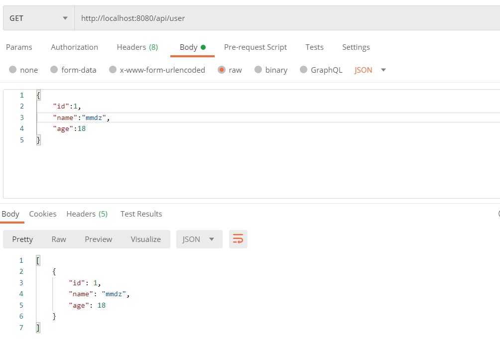
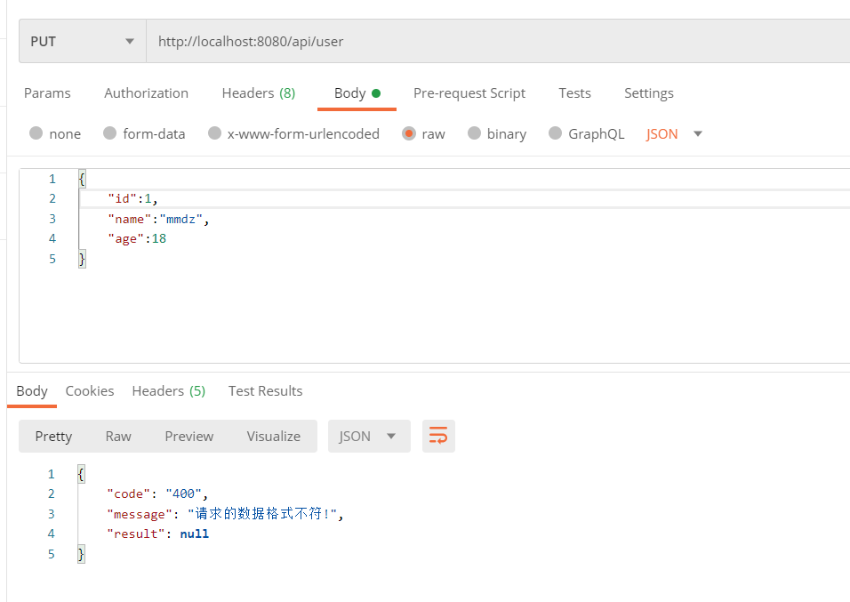
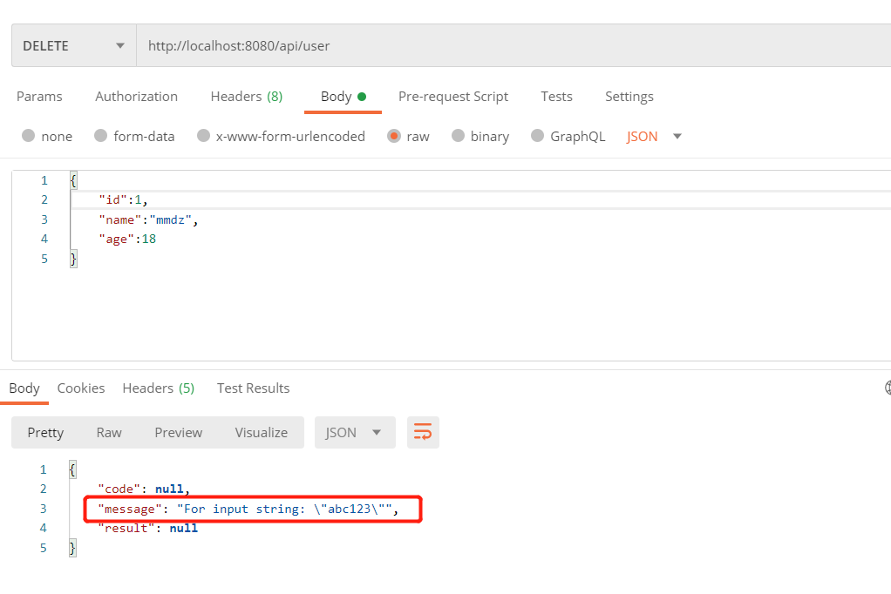
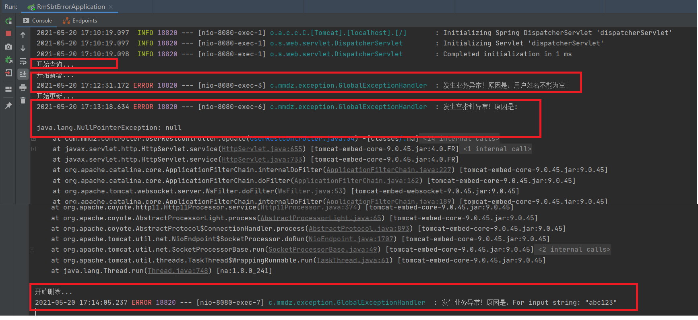

# SpringBoot全局异常准备


## 开发准备

首先还是Maven的相关依赖:

```xml
<?xml version="1.0" encoding="UTF-8"?>
<project xmlns="http://maven.apache.org/POM/4.0.0" xmlns:xsi="http://www.w3.org/2001/XMLSchema-instance"
         xsi:schemaLocation="http://maven.apache.org/POM/4.0.0 https://maven.apache.org/xsd/maven-4.0.0.xsd">
    <modelVersion>4.0.0</modelVersion>
    <parent>
        <groupId>org.springframework.boot</groupId>
        <artifactId>spring-boot-starter-parent</artifactId>
        <version>2.4.5</version>
        <relativePath/> <!-- lookup parent from repository -->
    </parent>
    <groupId>com.mmdz</groupId>
    <artifactId>rm_sbt_error</artifactId>
    <version>0.0.1-SNAPSHOT</version>
    <name>rm_sbt_error</name>
    <description>Demo project for Spring Boot</description>
    <properties>
        <java.version>1.8</java.version>
    </properties>
    <dependencies>
        <!-- Spring Boot Web 依赖 核心 -->
        <dependency>
            <groupId>org.springframework.boot</groupId>
            <artifactId>spring-boot-starter-web</artifactId>
        </dependency>
        <!-- Spring Boot Test 依赖 -->
        <dependency>
            <groupId>org.springframework.boot</groupId>
            <artifactId>spring-boot-starter-test</artifactId>
            <scope>test</scope>
        </dependency>

        <dependency>
            <groupId>com.alibaba</groupId>
            <artifactId>fastjson</artifactId>
            <version>1.2.41</version>
        </dependency>
        <dependency>
            <groupId>org.projectlombok</groupId>
            <artifactId>lombok</artifactId>
            <version>1.18.20</version>
        </dependency>
    </dependencies>

    <build>
        <plugins>
            <plugin>
                <groupId>org.springframework.boot</groupId>
                <artifactId>spring-boot-maven-plugin</artifactId>
            </plugin>
        </plugins>
    </build>

</project>
```

配置文件这块基本不需要更改，全局异常的处理只需在代码中实现即可。

## 代码编写

SpringBoot的项目已经对有一定的异常处理了，但是对于我们开发者而言可能就不太合适了，因此我们需要对这些异常进行统一的捕获并处理。SpringBoot中有一个`ControllerAdvice`的注解，使用该注解表示开启了全局异常的捕获，我们只需在自定义一个方法使用`ExceptionHandler`注解然后定义捕获异常的类型即可对这些捕获的异常进行统一的处理。

我们根据下面的这个示例来看该注解是如何使用吧。

示例代码:

#### 自定义的异常类

```java
package com.mmdz.exception;

import org.springframework.web.bind.annotation.ControllerAdvice;
import org.springframework.web.bind.annotation.ExceptionHandler;

/**
 * @Author: MMDZ
 * @Date: 2021/5/20
 * @Desc:
 */
@ControllerAdvice
public class MyExceptionHandler {

    @ExceptionHandler(value =Exception.class)
    public String exceptionHandler(Exception e){
        System.out.println("未知异常！原因是:"+e);
        return e.getMessage();
    }
}
```

> 上述的示例中，我们对捕获的异常进行简单的二次处理，返回异常的信息，虽然这种能够让我们知道异常的原因，但是在很多的情况下来说，可能还是不够人性化，不符合我们的要求。那么我们这里可以通过自定义的异常类以及枚举类来实现我们想要的那种数据吧。

#### **自定义基础接口类**

首先定义一个基础的接口类，自定义的错误描述枚举类需实现该接口。**代码如下:**

```java
package com.mmdz.exception.model;

/**
 * @Author: MMDZ
 * @Date: 2021/5/20
 * @Desc: 自定义基础接口类
 */
public interface BaseErrorInfoInterface {

    /** 错误码*/
    String getResultCode();

    /** 错误描述*/
    String getResultMsg();

}
```

#### **自定义枚举类**

然后我们这里在自定义一个枚举类，并实现该接口。**代码如下:**

```java
package com.mmdz.common.model;

import com.mmdz.exception.model.BaseErrorInfoInterface;

/**
 * @Author: MMDZ
 * @Date: 2021/5/20
 * @Desc: 自定义枚举类
 */
public enum CommonEnum implements BaseErrorInfoInterface {

    // 数据操作错误定义
    SUCCESS("200", "成功!"),
    BODY_NOT_MATCH("400","请求的数据格式不符!"),
    SIGNATURE_NOT_MATCH("401","请求的数字签名不匹配!"),
    NOT_FOUND("404", "未找到该资源!"),
    INTERNAL_SERVER_ERROR("500", "服务器内部错误!"),
    SERVER_BUSY("503","服务器正忙，请稍后再试!")
    ;

    /** 错误码 */
    private String resultCode;

    /** 错误描述 */
    private String resultMsg;

    CommonEnum(String resultCode, String resultMsg) {
        this.resultCode = resultCode;
        this.resultMsg = resultMsg;
    }

    @Override
    public String getResultCode() {
        return resultCode;
    }

    @Override
    public String getResultMsg() {
        return resultMsg;
    }

}
```

#### **自定义异常类**

然后我们在来自定义一个异常类，用于处理我们发生的业务异常。**代码如下:**

```java
package com.mmdz.exception.model;

import lombok.Data;

/**
 * @Author: MMDZ
 * @Date: 2021/5/20
 * @Desc: 自定义异常类
 */
@Data
public class BizException extends RuntimeException {

    private static final long serialVersionUID = 1L;

    /**
     * 错误码
     */
    protected String errorCode;
    /**
     * 错误信息
     */
    protected String errorMsg;

    public BizException() {
        super();
    }

    public BizException(BaseErrorInfoInterface errorInfoInterface) {
        super(errorInfoInterface.getResultCode());
        this.errorCode = errorInfoInterface.getResultCode();
        this.errorMsg = errorInfoInterface.getResultMsg();
    }

    public BizException(BaseErrorInfoInterface errorInfoInterface, Throwable cause) {
        super(errorInfoInterface.getResultCode(), cause);
        this.errorCode = errorInfoInterface.getResultCode();
        this.errorMsg = errorInfoInterface.getResultMsg();
    }

    public BizException(String errorMsg, Throwable cause) {
        super(errorMsg, cause);
        this.errorMsg = errorMsg;
    }

    public BizException(String errorMsg) {
        super(errorMsg);
        this.errorMsg = errorMsg;
    }

    public BizException(String errorCode, String errorMsg) {
        super(errorCode);
        this.errorCode = errorCode;
        this.errorMsg = errorMsg;
    }

    public BizException(String errorCode, String errorMsg, Throwable cause) {
        super(errorCode, cause);
        this.errorCode = errorCode;
        this.errorMsg = errorMsg;
    }

    @Override
    public Throwable fillInStackTrace() {
        return this;
    }

}
```

#### **自定义数据格式**

顺便这里我们定义一下数据的传输格式。**代码如下:**

```java
package com.mmdz.common.model;

import com.alibaba.fastjson.JSONObject;
import com.mmdz.exception.model.BaseErrorInfoInterface;
import lombok.Data;

/**
 * @Author: MMDZ
 * @Date: 2021/5/20
 * @Desc:
 */
@Data
public class ResultBody {

    /**
     * 响应代码
     */
    private String code;

    /**
     * 响应消息
     */
    private String message;

    /**
     * 响应结果
     */
    private Object result;

    public ResultBody() {
    }

    public ResultBody(BaseErrorInfoInterface errorInfo) {
        this.code = errorInfo.getResultCode();
        this.message = errorInfo.getResultMsg();
    }

    /**
     * 成功
     *
     * @return
     */
    public static ResultBody success(String code, String message, Object result) {
        ResultBody rb = new ResultBody();
        rb.setCode(code);
        rb.setMessage(message);
        rb.setResult(result);
        return rb;
    }

    /**
     * 成功
     *
     * @return
     */
    public static ResultBody success() {
        return success(null);
    }

    /**
     * 成功
     * @param data
     * @return
     */
    public static ResultBody success(Object data) {
        return success(CommonEnum.SUCCESS.getResultCode(),CommonEnum.SUCCESS.getResultMsg(),data);
    }

    /**
     * 失败
     */
    public static ResultBody error(String code, String message) {
        ResultBody rb = new ResultBody();
        rb.setCode(code);
        rb.setMessage(message);
        rb.setResult(null);
        return rb;
    }

    /**
     * 失败
     */
    public static ResultBody error(BaseErrorInfoInterface errorInfo) {
        return error(errorInfo.getResultCode(),errorInfo.getResultMsg());
    }

    /**
     * 失败
     */
    public static ResultBody error( String message) {
        return error("-1", message);
    }

    @Override
    public String toString() {
        return JSONObject.toJSONString(this);
    }

}
```

#### **自定义全局异常处理类**

最后我们在来编写一个自定义全局异常处理的类。**代码如下:**

```java
package com.mmdz.exception;

import com.mmdz.common.model.CommonEnum;
import com.mmdz.common.model.ResultBody;
import com.mmdz.exception.model.BizException;
import org.slf4j.Logger;
import org.slf4j.LoggerFactory;
import org.springframework.web.bind.annotation.ExceptionHandler;
import org.springframework.web.bind.annotation.ResponseBody;
import org.springframework.web.bind.annotation.RestControllerAdvice;

import javax.servlet.http.HttpServletRequest;

/**
 * @Author: MMDZ
 * @Date: 2021/5/20
 * @Desc: 自定义全局异常处理类
 */
@RestControllerAdvice
public class GlobalExceptionHandler {

    private static final Logger logger = LoggerFactory.getLogger(GlobalExceptionHandler.class);

    /**
     * 处理自定义的业务异常
     * @param req
     * @param e
     * @return
     */
    @ExceptionHandler(value = BizException.class)
    @ResponseBody
    public ResultBody bizExceptionHandler(HttpServletRequest req, BizException e){
        logger.error("发生业务异常！原因是：{}",e.getErrorMsg());
        return ResultBody.error(e.getErrorCode(),e.getErrorMsg());
    }

    /**
     * 处理空指针的异常
     * @param req
     * @param e
     * @return
     */
    @ExceptionHandler(value =NullPointerException.class)
    @ResponseBody
    public ResultBody exceptionHandler(HttpServletRequest req, NullPointerException e){
        logger.error("发生空指针异常！原因是:",e);
        return ResultBody.error(CommonEnum.BODY_NOT_MATCH);
    }

    /**
     * 处理其他异常
     * @param req
     * @param e
     * @return
     */
    @ExceptionHandler(value =Exception.class)
    @ResponseBody
    public ResultBody exceptionHandler(HttpServletRequest req, Exception e){
        logger.error("未知异常！原因是:",e);
        return ResultBody.error(CommonEnum.INTERNAL_SERVER_ERROR);
    }
}
```

因为这里我们只是用于做全局异常处理的功能实现以及测试，所以这里我们只需在添加一个实体类和一个控制层类即可。

#### **实体类**

又是万能的用户表 (*▽*)

**代码如下：**

```java
package com.mmdz.entity;

import com.alibaba.fastjson.JSONObject;
import lombok.Getter;
import lombok.NoArgsConstructor;
import lombok.Setter;

import java.io.Serializable;

/**
 * @Author: MMDZ
 * @Date: 2021/5/20
 * @Desc:
 */
@Getter
@Setter
@NoArgsConstructor
public class User implements Serializable {

    private static final long serialVersionUID = 1L;

    /** 编号 */
    private Long id;
    /** 姓名 */
    private String name;
    /** 年龄 */
    private Integer age;

    public String toString() {
        return JSONObject.toJSONString(this);
    }
}
```

#### **Controller 控制层**

控制层这边也比较简单，使用Restful风格实现的CRUD功能，不同的是这里我故意弄出了一些异常，好让这些异常被捕获到然后处理。这些异常中，有自定义的异常抛出，也有空指针的异常抛出，当然也有不可预知的异常抛出(这里我用类型转换异常代替)，那么我们在完成代码编写之后，看看这些异常是否能够被捕获处理成功吧！

**代码如下:**

```java
package com.mmdz.controller;

import com.mmdz.entity.User;
import com.mmdz.exception.model.BizException;
import org.springframework.web.bind.annotation.*;

import java.util.ArrayList;
import java.util.List;

/**
 * @Author: MMDZ
 * @Date: 2021/5/20
 * @Desc:
 */
@RestController
@RequestMapping(value = "/api")
public class UserRestController {

    @PostMapping("/user")
    public boolean insert(@RequestBody User user) {
        System.out.println("开始新增...");
        //如果姓名为空就手动抛出一个自定义的异常！
        if(user.getName()==null){
            throw new BizException("-1","用户姓名不能为空！");
        }
        return true;
    }

    @PutMapping("/user")
    public boolean update(@RequestBody User user) {
        System.out.println("开始更新...");
        //这里故意造成一个空指针的异常，并且不进行处理
        String str=null;
        str.equals("111");
        return true;
    }

    @DeleteMapping("/user")
    public boolean delete(@RequestBody User user)  {
        System.out.println("开始删除...");
        try {
            //这里故意造成一个异常，捕获处理
            Integer.parseInt("abc123");
        }catch (Exception e){
            throw new BizException(e.getMessage(), e);
        }
        return true;
    }

    @GetMapping("/user")
    public List<User> findByUser(User user) {
        System.out.println("开始查询...");
        List<User> userList =new ArrayList<>();
        User user2=new User();
        user2.setId(1L);
        user2.setName("xuwujing");
        user2.setAge(18);
        userList.add(user2);
        return userList;
    }

}
```

#### **启动类**

和普通的SpringBoot项目基本一样。

**代码如下:**

```java
package com.mmdz;

import org.springframework.boot.SpringApplication;
import org.springframework.boot.autoconfigure.SpringBootApplication;

@SpringBootApplication
public class RmSbtErrorApplication {

    public static void main(String[] args) {
        SpringApplication.run(RmSbtErrorApplication.class, args);
        System.out.println("程序正在运行...");
    }

}
```

## 功能测试

我们成功启动该程序之后，使用Postman工具来进行接口测试。

首先进行查询，查看程序正常运行是否ok，使用GET 方式进行请求。

> GET http://localhost:8080/api/user

返回参数为:

> {"id":1,"name":"mmdz","age":18}

**示例图:**



可以看到程序正常返回，并没有因自定义的全局异常而影响。

然后我们再来测试下自定义的异常是否能够被正确的捕获并处理。

使用POST方式进行请求

> POST http://localhost:8080/api/user

Body参数为:

> {"id":1,"age":18}

返回参数为:

> {"code":"-1","message":"用户姓名不能为空！","result":null}

**示例图:**


可以看出将我们抛出的异常进行数据封装，然后将异常返回出来。

然后我们再来测试下空指针异常是否能够被正确的捕获并处理。在自定义全局异常中，我们除了定义空指针的异常处理，也定义最高级别之一的Exception异常，那么这里发生了空指针异常之后，它是回优先使用哪一个呢？这里我们来测试下。

使用PUT方式进行请求。

> PUT http://localhost:8080/api/user

Body参数为:

> {"id":1,"age":18}

返回参数为:

> {"code":"400","message":"请求的数据格式不符!","result":null}

**示例图:**



我们可以看到这里的的确是返回空指针的异常护理，可以得出全局异常处理优先处理子类的异常。

那么我们在来试试未指定其异常的处理，看该异常是否能够被捕获。

使用DELETE方式进行请求。

> DELETE http://localhost:8080/api/user

Body参数为:

> {"id":1}

返回参数为:

> {"code":"500","message":"服务器内部错误!","result":null}

**示例图:**



这里可以看到它使用了我们在自定义全局异常处理类中的Exception异常处理的方法。到这里，测试就结束了。

#### IDEA执行结果



> - 开始查询：没有异常
> - 开始新增：自己条件判断，并抛出异常
> - 开始更新：全局处理空指针的异常
> - 开始删除：try{}catch(){}  捕获的异常

顺便再说一下，自义定全局异常处理除了可以处理上述的数据格式之外，也可以处理页面的跳转，只需在新增的异常方法的返回处理上填写该跳转的路径并不使用`ResponseBody` 注解即可。细心的同学也许发现了在`GlobalExceptionHandler`类中使用的是`ControllerAdvice`注解，而非`RestControllerAdvice`注解，如果是用的`RestControllerAdvice`注解，它会将数据自动转换成JSON格式，这种于`Controller`和`RestController`类似，所以我们在使用全局异常处理的之后可以进行灵活的选择处理。