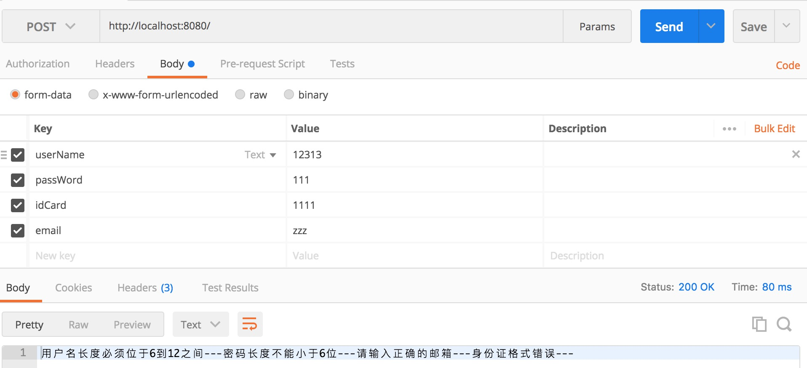
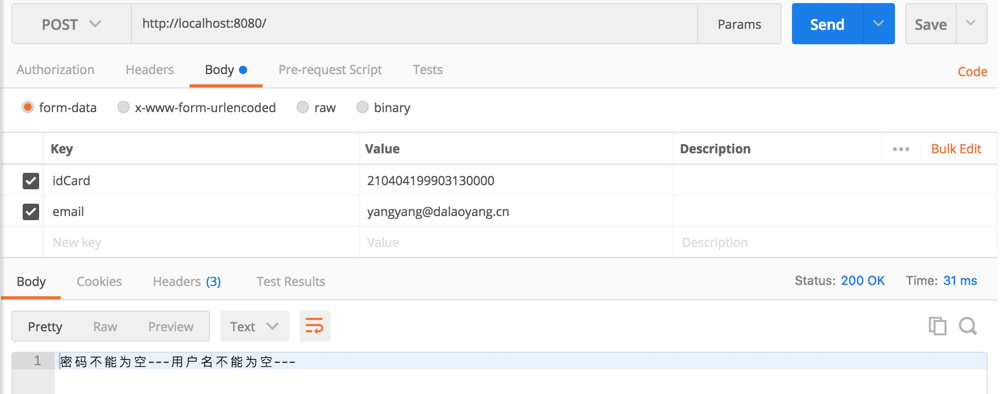
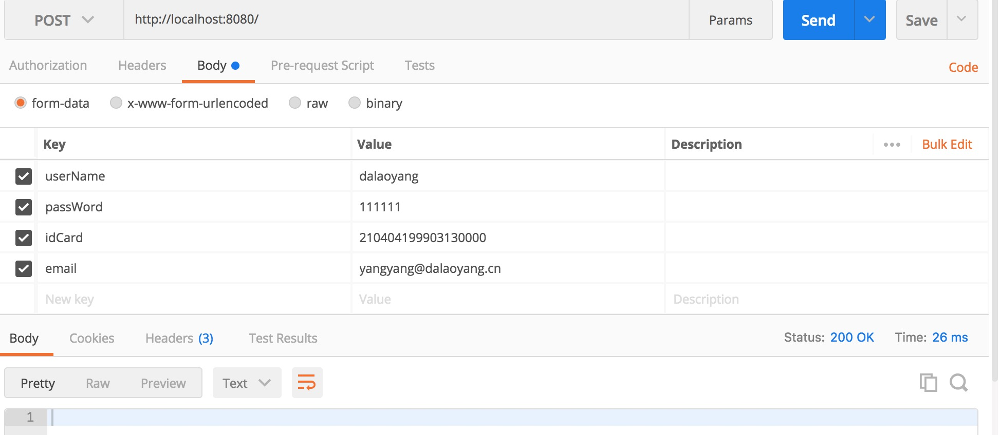

# SpringBoot使用validator校验

在前台表单验证的时候，通常会校验一些数据的可行性，比如是否为空，长度，身份证，邮箱等等，那么这样是否是安全的呢，答案是否定的。因为也可以通过模拟前台请求等工具来直接提交到后台，比如postman这样的工具，那么遇到这样的问题怎么办呢，我们可以在后台也做相应的校验。

新建项目，因为本文会使用postman模拟前端请求，所以本文需要加入web依赖，pom文件如下：

```xml
<?xml version="1.0" encoding="UTF-8"?>
<project xmlns="http://maven.apache.org/POM/4.0.0" xmlns:xsi="http://www.w3.org/2001/XMLSchema-instance"
         xsi:schemaLocation="http://maven.apache.org/POM/4.0.0 https://maven.apache.org/xsd/maven-4.0.0.xsd">
    <modelVersion>4.0.0</modelVersion>
    <parent>
        <groupId>org.springframework.boot</groupId>
        <artifactId>spring-boot-starter-parent</artifactId>
        <version>2.4.5</version>
        <relativePath/> <!-- lookup parent from repository -->
    </parent>
    <groupId>com.mmdz</groupId>
    <artifactId>rm_sbt_validator</artifactId>
    <version>0.0.1-SNAPSHOT</version>
    <name>rm_sbt_validator</name>
    <description>Demo project for Spring Boot</description>
    <properties>
        <project.build.sourceEncoding>UTF-8</project.build.sourceEncoding>
        <project.reporting.outputEncoding>UTF-8</project.reporting.outputEncoding>
        <java.version>1.8</java.version>
    </properties>
    <dependencies>
        <dependency>
            <groupId>org.springframework.boot</groupId>
            <artifactId>spring-boot-starter-web</artifactId>
        </dependency>

        <dependency>
            <groupId>org.springframework.boot</groupId>
            <artifactId>spring-boot-devtools</artifactId>
            <scope>runtime</scope>
        </dependency>

        <dependency>
            <groupId>org.springframework.boot</groupId>
            <artifactId>spring-boot-starter-test</artifactId>
            <scope>test</scope>
        </dependency>

        <!-- hibernate validator-->
        <dependency>
            <groupId>org.hibernate</groupId>
            <artifactId>hibernate-validator</artifactId>
            <version>5.2.0.Final</version>
        </dependency>

        <dependency>
            <groupId>org.projectlombok</groupId>
            <artifactId>lombok</artifactId>
            <version>1.18.20</version>
            <scope>provided</scope>
        </dependency>
    </dependencies>

    <build>
        <plugins>
            <plugin>
                <groupId>org.springframework.boot</groupId>
                <artifactId>spring-boot-maven-plugin</artifactId>
            </plugin>
        </plugins>
    </build>

</project>
```

创建一个User类，说一下本文使用User中校验使用的注解：

**常用的**

> ```
> @NotNull	被注释的元素（任何元素）必须不为 null, 集合为空也是可以的。没啥实际意义
> 
> @NotEmpty	用来校验字符串、集合、map、数组不能为null或空（字符串传入空格也不可以）（集合需至少包含一个元素）
> 
> @NotBlank	只用来校验字符串不能为null，空格也是被允许的 。校验字符串推荐使用@NotEmpty
> 
> @Size(max=, min=)	指定的字符串、集合、map、数组长度必须在指定的max和min内允许元素为null，字符串允许为空格
> 
> @Length(min=,max=)	只用来校验字符串，长度必须在指定的max和min内 允许元素为null
> 
> @Range(min=,max=)	用来校验数字或字符串的大小必须在指定的min和max内字符串会转成数字进行比较，如果不是数字校验不通过允许元素为null
> 
> @Min()	校验数字（包括integer short long int 等）的最小值，不支持小数即double和float允许元素为null
> 
> @Max()	校验数字（包括integer short long int 等）的最小值，不支持小数即double和float允许元素为null
> 
> @Pattern()	正则表达式匹配，可用来校验年月日格式，是否包含特殊字符（regexp = "^[a-zA-Z0-9\u4e00-\u9fa5
> ```

**不常用的**

> ```
> @Null 被注释的元素必须为 null
> @AssertTrue 被注释的元素必须为 true
> @AssertFalse 被注释的元素必须为 false
> @DecimalMin(value) 被注释的元素必须是一个数字，其值必须大于等于指定的最小值
> @DecimalMax(value) 被注释的元素必须是一个数字，其值必须小于等于指定的最大值
> @Digits (integer, fraction) 被注释的元素必须是一个数字，其值必须在可接受的范围内
> @Past 被注释的元素必须是一个过去的日期
> @Future 被注释的元素必须是一个将来的日期
> @Email 被注释的元素必须是电子邮箱地址
> ```

```java
package com.mmdz.entity;

import lombok.Data;
import org.hibernate.validator.constraints.Email;
import org.hibernate.validator.constraints.Length;
import org.hibernate.validator.constraints.NotEmpty;

import javax.validation.constraints.Pattern;
import java.io.Serializable;

/**
 * @Author: MMDZ
 * @Date: 2021/5/20
 * @Desc:
 */
@Data
public class User implements Serializable {

    @NotEmpty(message="用户名不能为空")
    @Length(min=6,max = 12,message="用户名长度必须位于6到12之间")
    private String userName;

    @NotEmpty(message="密码不能为空")
    @Length(min=6,message="密码长度不能小于6位")
    private String passWord;

    @NotEmpty(message="邮箱不能为空")
    @Email(message="邮箱格式错误")
    private String email;

    @NotEmpty(message="身份证不能为空")
    @Pattern(regexp = "^(\\d{18,18}|\\d{15,15}|(\\d{17,17}[x|X]))$", message = "身份证格式错误")
    private String idCard;

}
```

创建一个UserController，来测试本文的校验，代码如下：

```java
package com.mmdz.controller;

import com.mmdz.entity.User;
import org.springframework.validation.BindingResult;
import org.springframework.validation.ObjectError;
import org.springframework.web.bind.annotation.PostMapping;
import org.springframework.web.bind.annotation.RequestBody;
import org.springframework.web.bind.annotation.RestController;

import javax.validation.Valid;
import java.util.List;

/**
 * @Author: MMDZ
 * @Date: 2021/5/20
 * @Desc:
 */
@RestController
public class UserController {

    @PostMapping("/")
    public String testDemo(@RequestBody @Valid User user, BindingResult bindingResult){
        StringBuffer stringBuffer = new StringBuffer();
        // 如有任何一个错误
        if(bindingResult.hasErrors()){
            List<ObjectError> list =bindingResult.getAllErrors();
            for (ObjectError objectError:list) {
                stringBuffer.append(objectError.getDefaultMessage());
                stringBuffer.append("---");
            }
        }
        return stringBuffer!=null?stringBuffer.toString():"";
    }

}
```

启动项目使用postman分别做了三次请求，第一次所有属性都是随便填写的，如图



第二次输入正确的身份证和邮箱，用户名和密码为空，如图



第三次全部输入正确，如图



本文只是使用的简单的几种校验，Hibernate-validator还有很多种校验的方法，

大家可以参考这篇文章 `https://blog.csdn.net/xgblog/article/details/52548659`

