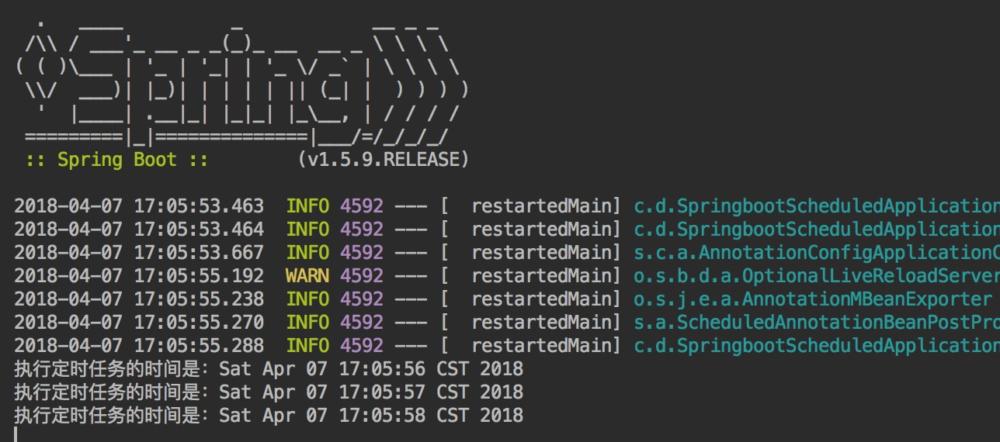

# SpringBoot定时任务

项目中很多时候会使用到定时任务，这篇文章介绍一下springboot整合定时任务。

> **springboot整合定时任务其实就两点：**
>
> 1. 创建一个能被定时任务类，方法上加入@Scheduled注解
> 2. 在启动类application上加入@EnableScheduling注解

代码如下，pom文件我只加入了devtools，其实不加入也可以

```xml
<?xml version="1.0" encoding="UTF-8"?>
<project xmlns="http://maven.apache.org/POM/4.0.0" xmlns:xsi="http://www.w3.org/2001/XMLSchema-instance"
         xsi:schemaLocation="http://maven.apache.org/POM/4.0.0 https://maven.apache.org/xsd/maven-4.0.0.xsd">
    <modelVersion>4.0.0</modelVersion>
    <parent>
        <groupId>org.springframework.boot</groupId>
        <artifactId>spring-boot-starter-parent</artifactId>
        <version>2.4.5</version>
        <relativePath/> <!-- lookup parent from repository -->
    </parent>
    <groupId>com.mmdz</groupId>
    <!--SpringBoot定时任务-->
    <artifactId>rm_sbt_scheduled</artifactId>
    <version>0.0.1-SNAPSHOT</version>
    <name>rm_sbt_scheduled</name>
    <description>Demo project for Spring Boot</description>
    <properties>
        <project.build.sourceEncoding>UTF-8</project.build.sourceEncoding>
        <project.reporting.outputEncoding>UTF-8</project.reporting.outputEncoding>
        <java.version>1.8</java.version>
    </properties>
    <dependencies>
        <dependency>
            <groupId>org.springframework.boot</groupId>
            <artifactId>spring-boot-starter</artifactId>
        </dependency>

        <dependency>
            <groupId>org.springframework.boot</groupId>
            <artifactId>spring-boot-starter-test</artifactId>
            <scope>test</scope>
        </dependency>

        <dependency>
            <groupId>org.springframework.boot</groupId>
            <artifactId>spring-boot-devtools</artifactId>
            <scope>runtime</scope>
        </dependency>
    </dependencies>

    <build>
        <plugins>
            <plugin>
                <groupId>org.springframework.boot</groupId>
                <artifactId>spring-boot-maven-plugin</artifactId>
            </plugin>
        </plugins>
    </build>

</project>
```

application类代码如下：

```java
package com.mmdz;

import org.springframework.boot.SpringApplication;
import org.springframework.boot.autoconfigure.SpringBootApplication;
import org.springframework.scheduling.annotation.EnableScheduling;

@SpringBootApplication
@EnableScheduling
public class RmSbtScheduledApplication {

    public static void main(String[] args) {
        SpringApplication.run(RmSbtScheduledApplication.class, args);
    }

}
```

定时任务类TestTimer

```java
package com.mmdz;

import org.springframework.scheduling.annotation.Scheduled;
import org.springframework.stereotype.Component;

import java.util.Date;

/**
 * @Author: MMDZ
 * @Date: 2021/5/20
 * @Desc: 定时任务类TestTimer
 */
@Component
public class TestTimer {

    /* 一秒钟执行一次  cron表达式（http://cron.qqe2.com/）*/
    @Scheduled(cron = "0/1 * * * * ?")
    private void test() {
        System.out.println("执行定时任务的时间是："+new Date());
    }

}
```

到这里启动项目，可以看到控制台如下


需要注意的是@Scheduled(cron = “0/1 * * * * ?”)中cron的值根据自己实际需要去写，如果需要可以去下面的网站去弄。
http://cron.qqe2.com/