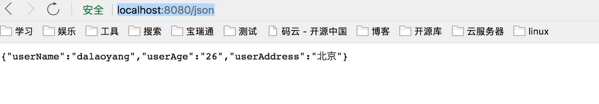
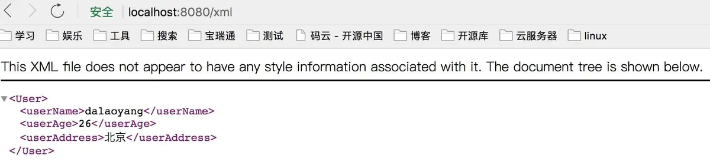

# SpringBoot返回json和xml

有些情况接口需要返回的是xml数据，在springboot中并不需要每次都转换一下数据格式，只需做一些微调整即可。

新建一个springboot项目，加入依赖jackson-dataformat-xml，pom文件代码如下：

```xml
<?xml version="1.0" encoding="UTF-8"?>
<project xmlns="http://maven.apache.org/POM/4.0.0" xmlns:xsi="http://www.w3.org/2001/XMLSchema-instance"
         xsi:schemaLocation="http://maven.apache.org/POM/4.0.0 https://maven.apache.org/xsd/maven-4.0.0.xsd">
    <modelVersion>4.0.0</modelVersion>
    <parent>
        <groupId>org.springframework.boot</groupId>
        <artifactId>spring-boot-starter-parent</artifactId>
        <version>2.4.5</version>
        <relativePath/> <!-- lookup parent from repository -->
    </parent>
    <groupId>com.mmdz</groupId>
    <artifactId>rm_sbt_xml</artifactId>
    <version>0.0.1-SNAPSHOT</version>
    <name>rm_sbt_xml</name>
    <description>Demo project for Spring Boot</description>
    <properties>
        <project.build.sourceEncoding>UTF-8</project.build.sourceEncoding>
        <project.reporting.outputEncoding>UTF-8</project.reporting.outputEncoding>
        <java.version>1.8</java.version>
    </properties>
    <dependencies>
        <dependency>
            <groupId>org.springframework.boot</groupId>
            <artifactId>spring-boot-starter-web</artifactId>
        </dependency>
        <dependency>
            <groupId>org.springframework.boot</groupId>
            <artifactId>spring-boot-devtools</artifactId>
            <scope>runtime</scope>
        </dependency>
        <dependency>
            <groupId>org.springframework.boot</groupId>
            <artifactId>spring-boot-starter-test</artifactId>
            <scope>test</scope>
        </dependency>

        <dependency>
            <groupId>com.fasterxml.jackson.dataformat</groupId>
            <artifactId>jackson-dataformat-xml</artifactId>
        </dependency>
    </dependencies>

    <build>
        <plugins>
            <plugin>
                <groupId>org.springframework.boot</groupId>
                <artifactId>spring-boot-maven-plugin</artifactId>
            </plugin>
        </plugins>
    </build>

</project>
```

启动类默认即可，没有做任何调整。

新建一个user类，代码如下：

```java
package com.mmdz.entity;

import javax.xml.bind.annotation.XmlElement;
import javax.xml.bind.annotation.XmlRootElement;

/**
 * @Author: MMDZ
 * @Date: 2021/5/20
 * @Desc:
 */
@XmlRootElement
public class User {

    private String userName;
    private String userAge;
    private String userAddress;

    public User(String userName, String userAge, String userAddress) {
        this.userName = userName;
        this.userAge = userAge;
        this.userAddress = userAddress;
    }

    @XmlElement
    public String getUserName() {
        return userName;
    }

    public void setUserName(String userName) {
        this.userName = userName;
    }

    @XmlElement
    public String getUserAge() {
        return userAge;
    }

    public void setUserAge(String userAge) {
        this.userAge = userAge;
    }

    @XmlElement
    public String getUserAddress() {
        return userAddress;
    }

    public void setUserAddress(String userAddress) {
        this.userAddress = userAddress;
    }
}
```

最后是controller，代码如下：

```java
package com.mmdz.controller;

import com.mmdz.entity.User;
import org.springframework.http.MediaType;
import org.springframework.web.bind.annotation.GetMapping;
import org.springframework.web.bind.annotation.RestController;

/**
 * @Author: MMDZ
 * @Date: 2021/5/20
 * @Desc:
 */
@RestController
public class UserController {

    //http://localhost:8080/json
    @GetMapping(value = "/json",produces = MediaType.APPLICATION_JSON_VALUE)
    public User index(){
        User user = new User("mmdz", "26", "深圳");
        return user;
    }


    //http://localhost:8080/xml
    @GetMapping(value = "/xml",produces = MediaType.APPLICATION_XML_VALUE)
    public User XML(){
        User user = new User("mmdz", "26", "深圳");
        return user;
    }

}
```

到这里就可以启动项目了，访问http://localhost:8080/json,可以看到如下图




访问http://localhost:8080/xml，如下图



