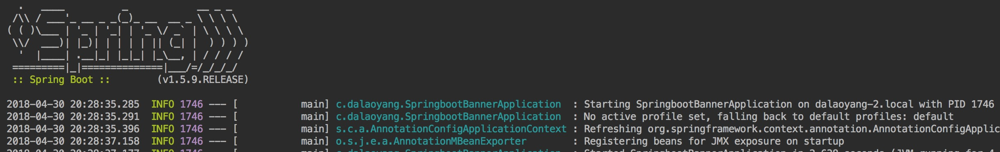
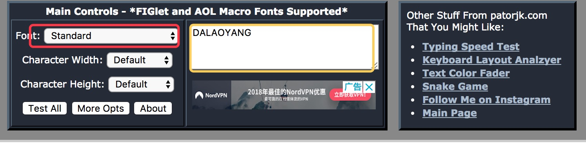
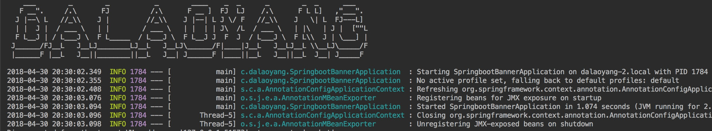
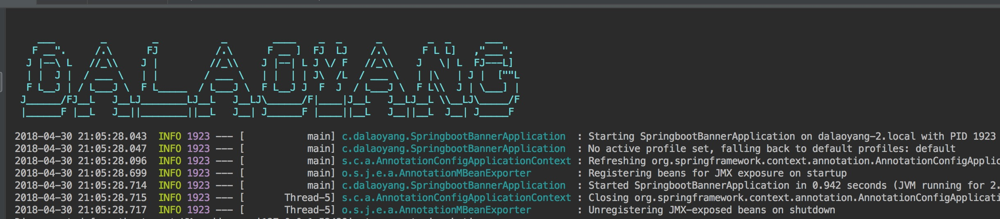
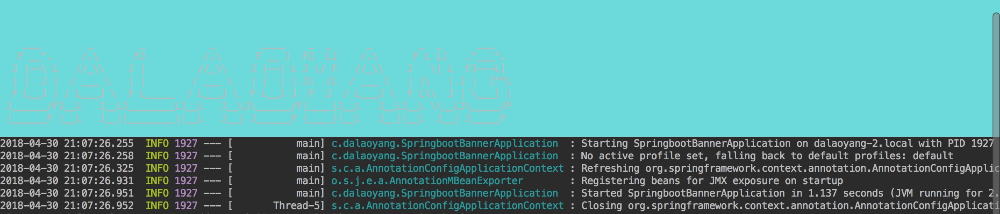
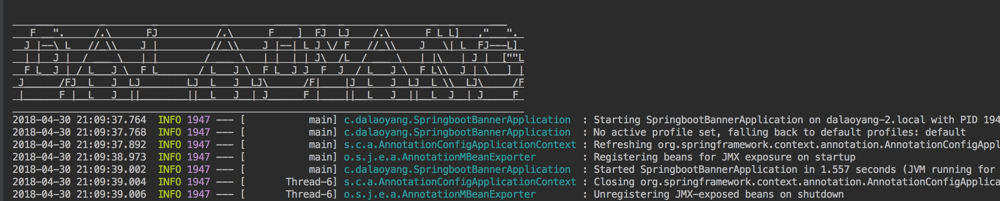
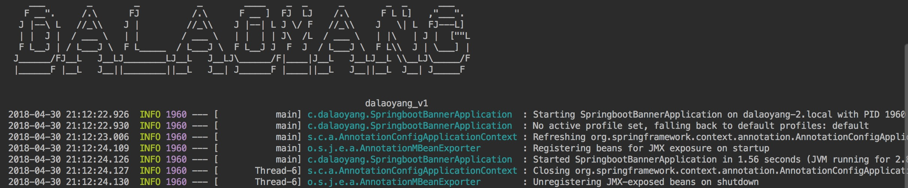
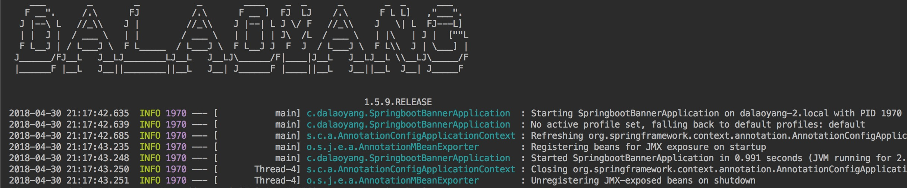

# SpringBoot启动banner更改

这篇文章的开始先给大家看一个图片



用过或者看过springboot的人都知道，这就是springboot启动的banner，这一篇介绍如何自定义springboot的启动bannner。

先介绍一个可以制作自定义banner的网站，传送门：[http://patorjk.com/software/taag/#p=display&f=Graffiti&t=Type%20Something%20](http://patorjk.com/software/taag/#p=display&f=Graffiti&t=Type Something )



黄框内输入自定义文字，红框内填写字体，本文使用banner

```
    ___        _        _           _        ____    _  _      _        _  _      ___
   F __".     /.\      FJ          /.\      F __ ]  FJ  LJ    /.\      F L L]   ,"___". 
  J |--\ L   //_\\    J |         //_\\    J |--| L J \/ F   //_\\    J   \| L  FJ---L] 
  | |  J |  / ___ \   | |        / ___ \   | |  | | J\  /L  / ___ \   | |\   | J |  [""L
  F L__J | / L___J \  F L_____  / L___J \  F L__J J  F  J  / L___J \  F L\\  J | \___] |
 J______/FJ__L   J__LJ________LJ__L   J__LJ\______/F|____|J__L   J__LJ__L \\__LJ\_____/F
 |______F |__L   J__||________||__L   J__| J______F |____||__L   J__||__L  J__| J_____F 
```

新建banner.txt放入resources下，启动可以看到



另外spring提供了几种类型来设定banner：
1.${AnsiColor.BRIGHT_CYAN}来设定banner字体，如图



2.${AnsiBackground.BRIGHT_CYAN}来设定banner背景颜色，（本次demo样板较丑，勿喷），如图



3.${AnsiStyle.UNDERLINE}设定字体样式



还提供了几种与版本相关的，这里就简单举例说明2个，

1.在配置文件中加入配置，如下：

```properties
application.version=mmdz_v1
```

在banner中加入${application.version}使用，启动如图



配置文件加入

```properties
spring.application.name=mmdz
```

banner中加入${spring.application.name}，如图

2.使用springboot的版本

在banner中加入${spring-boot.version}，启动如图



