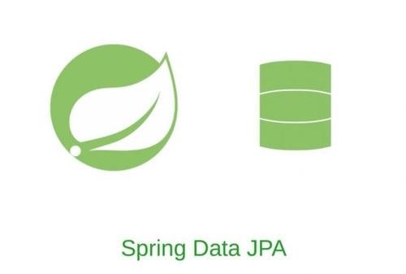
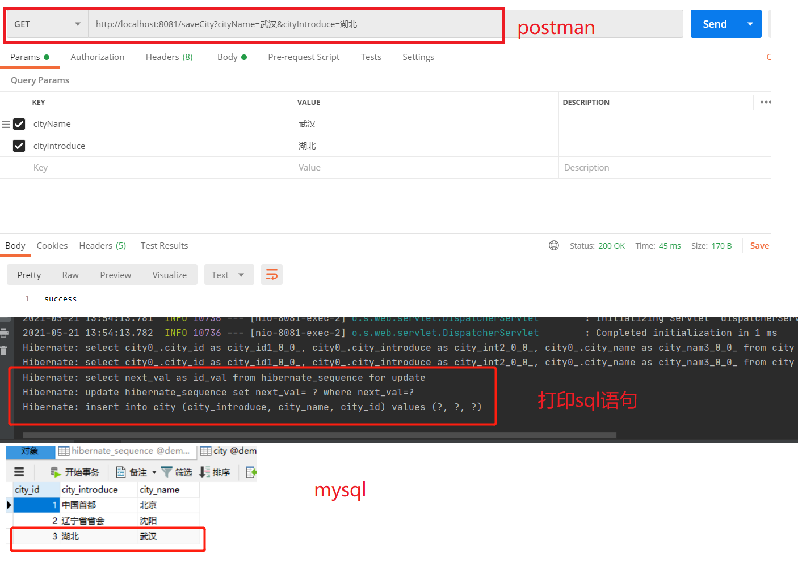
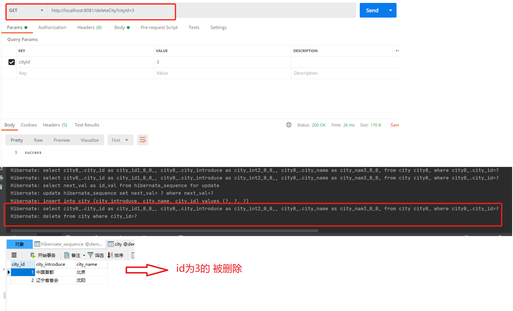
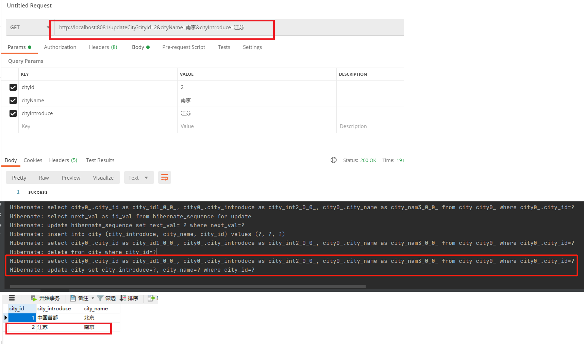
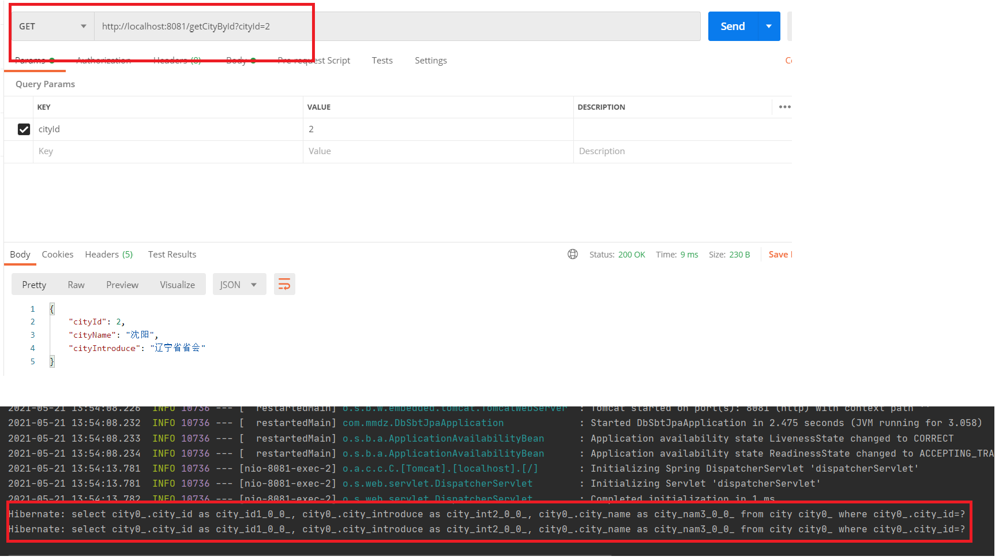

# SpringBoot整合Jpa



由于jpa的功能强大，后续会继续写关于jpa的介绍已经使用，本文只是简单介绍一下它与springboot的整合。

## Jpa文档

> **官方文档：**`https://spring.io/projects/spring-data-jpa`
>
> **pdf 中文文档：**`https://pan.baidu.com/s/1FMQZnLWenprl0ZZORqkk-A`  **密码：** `MMDZ`

jpa不需要像mybatis一样创建表，首先给大家看一下application.properties文件代码，其中包含了jpa的配置和数据库配置，尤其注意一下spring.jpa.hibernate.ddl-auto属性，代码如下：

## 配置

```properties
##端口号
server.port=8081

##数据库配置
##数据库地址
spring.datasource.url=jdbc:mysql://localhost:3306/demo?characterEncoding=utf8&useSSL=false
##数据库用户名
spring.datasource.username=root
##数据库密码
spring.datasource.password=123456
##数据库驱动
spring.datasource.driver-class-name=com.mysql.jdbc.Driver

##spring.jpa.hibernate.ddl-auto四个属性的含义
##create   每次加载hibernate，重新创建数据库表结构，这就是导致数据库表数据丢失的原因。
##create-drop        加载hibernate时创建，退出是删除表结构
##update                 加载hibernate自动更新数据库结构
##validate 启动时验证表的结构，不会创建表
##none  启动时不做任何操作
spring.jpa.hibernate.ddl-auto=none

##控制台打印sql
spring.jpa.show-sql=true
```

## 启动类

```java
package com.dalaoyang;

import org.springframework.boot.SpringApplication;
import org.springframework.boot.autoconfigure.SpringBootApplication;

@SpringBootApplication
public class SpringbootJpaApplication {

    public static void main(String[] args) {
        SpringApplication.run(SpringbootJpaApplication.class, args);
    }
}
```

## pom文件

```xml
<?xml version="1.0" encoding="UTF-8"?>
<project xmlns="http://maven.apache.org/POM/4.0.0" xmlns:xsi="http://www.w3.org/2001/XMLSchema-instance"
         xsi:schemaLocation="http://maven.apache.org/POM/4.0.0 https://maven.apache.org/xsd/maven-4.0.0.xsd">
    <modelVersion>4.0.0</modelVersion>
    <parent>
        <groupId>org.springframework.boot</groupId>
        <artifactId>spring-boot-starter-parent</artifactId>
        <version>2.5.0</version>
        <relativePath/> <!-- lookup parent from repository -->
    </parent>
    <groupId>com.mmdz</groupId>
    <artifactId>db_sbt_jpa</artifactId>
    <version>0.0.1-SNAPSHOT</version>
    <name>db_sbt_jpa</name>
    <description>Demo project for Spring Boot</description>
    <properties>
        <project.build.sourceEncoding>UTF-8</project.build.sourceEncoding>
        <project.reporting.outputEncoding>UTF-8</project.reporting.outputEncoding>
        <java.version>1.8</java.version>
    </properties>
    <dependencies>
        <dependency>
            <groupId>org.springframework.boot</groupId>
            <artifactId>spring-boot-starter-web</artifactId>
        </dependency>

        <dependency>
            <groupId>org.springframework.boot</groupId>
            <artifactId>spring-boot-devtools</artifactId>
            <scope>runtime</scope>
            <optional>true</optional>
        </dependency>
        <!--jpa-->
        <dependency>
            <groupId>org.springframework.boot</groupId>
            <artifactId>spring-boot-starter-data-jpa</artifactId>
        </dependency>
        <!--mysql-->
        <dependency>
            <groupId>mysql</groupId>
            <artifactId>mysql-connector-java</artifactId>
            <scope>runtime</scope>
        </dependency>
        <!--lombok-->
        <dependency>
            <groupId>org.projectlombok</groupId>
            <artifactId>lombok</artifactId>
            <optional>true</optional>
        </dependency>
        <dependency>
            <groupId>org.springframework.boot</groupId>
            <artifactId>spring-boot-starter-test</artifactId>
            <scope>test</scope>
        </dependency>
    </dependencies>

    <build>
        <plugins>
            <plugin>
                <groupId>org.springframework.boot</groupId>
                <artifactId>spring-boot-maven-plugin</artifactId>
                <configuration>
                    <excludes>
                        <exclude>
                            <groupId>org.projectlombok</groupId>
                            <artifactId>lombok</artifactId>
                        </exclude>
                    </excludes>
                </configuration>
            </plugin>
        </plugins>
    </build>

</project>
```

## 实体类

其中@Table中的name对应数据库中表的名称

```java
package com.mmdz.entity;

import com.fasterxml.jackson.annotation.JsonIgnoreProperties;
import lombok.AllArgsConstructor;
import lombok.Data;
import lombok.NoArgsConstructor;

import javax.persistence.*;

/**
 * @Author: MMDZ
 * @Date: 2021/5/21
 * @Desc:
 */
@Entity
@Table(name = "city")
@Data
@NoArgsConstructor
@AllArgsConstructor
@JsonIgnoreProperties(value = { "hibernateLazyInitializer", "handler" })
public class City {

    @Id
    @GeneratedValue(strategy=GenerationType.AUTO)
    private int cityId;
    private String cityName;
    private String cityIntroduce;

    public City(String cityName, String cityIntroduce) {
        this.cityName = cityName;
        this.cityIntroduce = cityIntroduce;
    }
}
```

## repository

然后就是jpa的重要地方，CityRepository，继承了JpaRepository，
由于本文只是简单介绍了jpa的简单功能，所以JpaRepository中内置的方法已经足够使用。

代码如下：

```java
package com.mmdz.repository;

import com.mmdz.entity.City;
import org.springframework.data.jpa.repository.JpaRepository;

/**
 * @Author: MMDZ
 * @Date: 2021/5/21
 * @Desc:
 */
public interface CityRepository extends JpaRepository<City,Integer> {
}
```

## controller

```java
package com.mmdz.controller;

import com.mmdz.entity.City;
import com.mmdz.repository.CityRepository;
import org.springframework.beans.factory.annotation.Autowired;
import org.springframework.web.bind.annotation.GetMapping;
import org.springframework.web.bind.annotation.RestController;

import java.util.Optional;

/**
 * @Author: MMDZ
 * @Date: 2021/5/21
 * @Desc:
 */
@RestController
public class CityController {

    @Autowired
    private CityRepository cityRepository;

    /**
    //http://localhost:8081/saveCity?cityName=北京&cityIntroduce=中国首都
    //http://localhost:8081/saveCity?cityName=深圳&cityIntroduce=广东
    */
    @GetMapping(value = "saveCity")
    public String saveCity(String cityName,String cityIntroduce){
        City city = new City(cityName,cityIntroduce);
        cityRepository.save(city);
        return "success";
    }
	/**
    //http://localhost:8081/deleteCity?cityId=2
    */
    @GetMapping(value = "deleteCity")
    public String deleteCity(int cityId){
        cityRepository.deleteById(cityId);
        return "success";
    }
	/**
    //http://localhost:8081/updateCity?cityId=3&cityName=南京&cityIntroduce=江苏
    */
    @GetMapping(value = "updateCity")
    public String updateCity(int cityId,String cityName,String cityIntroduce){
        City city = new City(cityId,cityName,cityIntroduce);
        cityRepository.save(city);
        return "success";
    }
	/**
    //http://localhost:8081/getCityById?cityId=2
    */
    @GetMapping(value = "getCityById")
    public City getCityById(int cityId){
        City city = cityRepository.getById(cityId);
        return city;
    }

}
```

到这里启动项目就可以简单测试一下整合的效果了。

> **saveCity（）**
>
> ```
> http://localhost:8081/saveCity?cityName=北京&cityIntroduce=中国首都
> http://localhost:8081/saveCity?cityName=深圳&cityIntroduce=广东
> ```
>
> 
>
> **deleteCity（）**
>
> ```
> http://localhost:8081/deleteCity?cityId=3
> ```
>
> 
>
> **updateCity（）**
>
> ```
> http://localhost:8081/updateCity?cityId=3&cityName=南京&cityIntroduce=江苏
> ```
>
> 
>
> **getCityById（）**
>
> ```
> http://localhost:8081/getCityById?cityId=2
> ```
>
> 


